# Guidebook Workshop: Under the Hood of FlutterFlow with Custom Code and Debugging

## Judul

**Under the Hood of FlutterFlow with Custom Code and Debugging**

*Go beyond visual drag-and-drop and discover how to gain complete control over your FlutterFlow applications through manual Dart coding, API debugging, and secure Firestore integration.*

## Deskripsi

Workshop ini adalah sesi 80 menit (slide presentasi + live demo digabung) yang menunjukkan sisi *developer* dari FlutterFlow — bukan generate app baru pakai AI, tapi bagaimana kontrol penuh atas debugging, custom code Dart, dan integrasi Firebase bisa dilakukan **manual di dalam UI editor FlutterFlow**. Segmen live demo (debugging, custom function, Firestore rules) sepenuhnya manual — tanpa AI assistant maupun CLI aktif mengontrol editor di panggung.

Project yang dipakai: **Tourism App**, aplikasi wisata yang mengonsumsi Tourism API publik (`tourism-api.dicoding.dev`, read-only, tanpa autentikasi). Sebelum sesi, project ini sudah disiapkan sebagai kerangka placeholder (4 halaman + API call terdaftar) lewat FlutterFlow CLI dan AI assistant lokal (Claude + FlutterFlow MCP). Berbeda dari draft awal, proses persiapan ini **tidak disembunyikan** — justru dijelaskan terbuka ke audiens di Segmen 4 (setelah Firestore, sebelum penutup), sebagai bentuk transparansi: seluruh project ini dibantu Claude + FlutterFlow MCP, dan sesi ini menunjukkan dengan jelas batas antara "yang dibantu AI di belakang layar" dan "yang dikerjakan manual di panggung."

**Catatan penting untuk presenter:** dua pembicara lain di acara yang sama fokus pada AI-generated app dari nol. Sesi ini sengaja tidak bersaing di sana — framing ke audiens selalu "ini bagian development inti yang tetap butuh keahlian manual, dengan atau tanpa AI."

## Tujuan Workshop

Setelah sesi ini, audiens diharapkan memahami:

1. Cara mendiagnosis dan memperbaiki bug parsing API secara manual di FlutterFlow (key mismatch `place` vs `places`).
2. Cara menulis Custom Function Dart murni (tanpa package pihak ketiga) untuk kebutuhan formatting data — truncate teks, format angka, hitung jarak geospasial.
3. Cara merancang struktur koleksi Firestore dan menulis Security Rules yang aman secara manual, termasuk mengenali pola rule yang terlalu longgar.
4. Bahwa FlutterFlow bukan cuma "visual builder" — ada kontrol developer penuh di baliknya.
5. Peran FlutterFlow MCP dalam persiapan project (scaffolding, export, inspect) — dan batas tegasnya dengan pekerjaan manual developer yang baru saja didemokan.

## Gambaran Output

Kondisi akhir project setelah seluruh sesi (termasuk perbaikan yang dilakukan live) — rekaman utuh: [tourism-app-final.mp4](images/tourism-app-final.mp4) (±54 detik, Home dengan deskripsi terpotong & like count terformat, lanjut ke Search).

| Halaman | Sebelum sesi (kerangka) | Sesudah sesi (live) |
|---|---|---|
| `HomePage` | List tempat wisata dari `/list`, deskripsi & like count masih mentah (belum diformat, berpotensi overflow) | Deskripsi terpotong rapi (`truncateDescription`), like count ringkas (`formatLikeCount`, misal "1.2K suka") |
| `DetailPage` | Custom Action salah asumsi key `places` (harusnya `place`) → data kosong/null saat dibuka | Data tempat wisata tampil lengkap (nama, deskripsi, alamat, gambar) setelah parsing diperbaiki |
| `SearchPage` | Search bar + hasil pencarian dari `/search?q=` | Tidak berubah — dipakai untuk menunjukkan bug di Segmen 1 tidak muncul di sini (karena `/search` memang pakai key `places`) |
| `FavoritesPage` | Placeholder kosong ("Firestore belum terhubung") | Siap menampilkan data like/favorite setelah Firestore + Security Rules dipasang di Segmen 3 |

Struktur project FlutterFlow yang relevan (semua sudah dibuat sebagai kerangka sebelum hari-H):

- **Halaman:** `HomePage`, `DetailPage`, `SearchPage`, `FavoritesPage`
- **API Group:** `TourismApi` — endpoint `ListPlaces` (`/list`), `GetPlaceDetail` (`/detail/{id}`), `SearchPlaces` (`/search?q=`)
- **Komponen:** `PlaceCard` (kartu tempat wisata dipakai di Home & Search)
- **Data struct:** `Place`, `PlaceListResponse`, `PlaceSearchResponse`, `PlaceDetailResponse`
- **Bottom navigation:** Home / Search / Favorites

## Langkah (Step-by-Step)

### 0. Pembukaan & Pengantar (5 menit)
- Perkenalkan diri, posisikan sesi ini di antara dua talk lain (bukan soal generate app baru — ini soal *maintain & extend* app yang sudah ada).
- Tunjukkan sekilas 4 halaman kerangka yang sudah ada (Home, Detail, Search, Favorites) — tegaskan ini sudah disiapkan sebelumnya, sekarang kita masuk ke "isi"-nya secara manual.

### 1. Segmen 1 — Manual Debugging: Dari Merah ke Hijau (7-10 menit)

**Langkah 0 — Sambungkan dulu navigasi Home → Detail (prasyarat, wajib sebelum lanjut ke debugging):**

Kerangka placeholder saat ini punya satu gap: tap di kartu `PlaceCard` pada `HomePage` belum diarahkan ke `DetailPage` — action-nya masih kosong. Tanpa ini, Detail Page tidak bisa diakses sama sekali dari Home, jadi harus disambungkan dulu sebelum audiens bisa melihat bug-nya.

1. Buka `HomePage` di FlutterFlow editor, masuk ke Test Mode dulu sekali untuk konfirmasi: tap salah satu kartu tempat wisata — pastikan memang tidak terjadi apa-apa (tidak berpindah halaman). Ini jadi bukti awal ke audiens bahwa ada yang perlu disambungkan manual.

   
2. Kembali ke Builder, pilih widget kartu `PlaceCard` di dalam `ListView` pada `HomePage`.
3. Di panel properti kartu, cari parameter aksinya (`onTapAction`) — klik untuk membuka Action Editor.
4. Tambahkan action baru: **Navigate To** → pilih `DetailPage` sebagai tujuan.
5. Pada parameter yang diminta (`placeId`), set value-nya dari data item list saat itu — pilih field `id` milik tempat wisata yang sedang di-tap (biasanya muncul di parameter picker sebagai `place → id`, sesuai nama variabel generator list-nya).
6. Simpan action, jalankan **Test Mode** lagi — tap kartu yang sama sekarang harus berpindah ke `DetailPage`.
7. **Ulangi langkah yang sama di `SearchPage`** untuk kartu `PlaceCard` di hasil pencarian — memakai component yang sama, jadi bug-nya identik.

Setelah navigasi ini tersambung, baru lanjut ke debugging key-mismatch di bawah — sekarang Detail Page sudah bisa dibuka dari Home, dan itulah yang akan menampilkan data kosong/null sebagai starting point Segmen 1.

**Debugging key mismatch (setelah navigasi tersambung):**

1. Tunjukkan dua bentuk respons API berdampingan di layar (screenshot atau dokumentasi):
   - `/list` → key jamak `places` (array)
   - `/detail/{id}` → key tunggal `place` (object)
2. Buka Custom Action / parsing logic di `DetailPage` yang **salah** mengasumsikan `/detail/{id}` juga mengembalikan `places` (array), padahal seharusnya `place` (object tunggal).
3. Jalankan **Test Mode**, buka Detail Page dari salah satu kartu di Home — tunjukkan ke audiens: data kosong / null / crash (gambar tempat wisata gagal tampil, muncul `EncodingError: The source image cannot be decoded` — akibat parsing salah field, bukan URL gambar asli yang kebaca).

   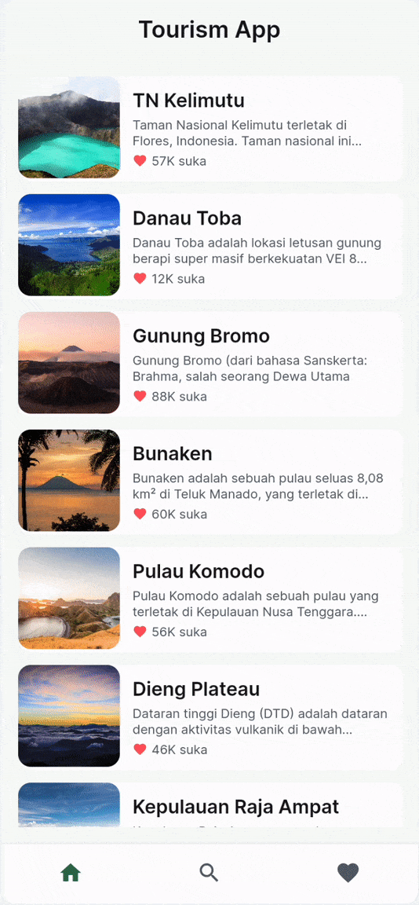
4. Jelaskan verbal ke audiens: *"`/detail/{id}` mengembalikan objek tunggal, bukan array — makanya asumsi kode tadi salah."*
5. Edit langsung di panel FlutterFlow: ubah referensi parsing dari `response['places']` menjadi `response['place']`.
6. Compile ulang, jalankan Test Mode lagi — Detail Page sekarang tampil benar (nama, deskripsi, alamat, gambar).

**Pesan kunci:** bug seperti ini sangat realistis dan mudah terjadi — key mismatch antar endpoint API yang mirip. Kemampuan membaca dokumentasi API + debug manual tetap krusial.

### 2. Segmen 2 — Custom Function Secara Manual (12-15 menit, segmen inti)

Semua kode di bawah **pure Dart, tanpa package pihak ketiga** — supaya tetap kompatibel meski suatu saat harus jalan di plan Free FlutterFlow.

**Navigasi awal:** dari sidebar FlutterFlow, buka panel **Custom Code** dulu — di sinilah rumah untuk Custom Function, Custom Widgets, Custom Actions, dll. Baru dari situ masuk ke sub-tab **Custom Functions** untuk langkah-langkah berikut.

**Fungsi 1 — `truncateDescription`:**

**Tujuan:** deskripsi tempat wisata dari Tourism API panjangnya beda-beda drastis antar item — kalau ditampilkan mentah di card `HomePage`, teks yang kepanjangan bikin card overflow / tinggi card jadi tidak konsisten antar item. Fungsi ini memotong deskripsi ke panjang maksimum tertentu, tapi tetap menjaga keterbacaan dengan tidak memenggal kata di tengah.

1. Di panel Custom Code → tab Custom Functions, klik **Add Custom Function**, beri nama `truncateDescription`.
2. Di panel kanan **Function Settings**: set **Return Value** ke tipe `String`. Lalu klik **Add Argument** dua kali untuk mendefinisikan parameter, sesuai urutan dipakai di kode:
   - `description` — tipe `String`
   - `maxLength` — tipe `Integer`
3. Ketik/tempel kode Dart-nya di editor:
   ```dart
   String truncateDescription(String description, int maxLength) {
     if (description.length <= maxLength) return description;
     String truncated = description.substring(0, maxLength);
     int lastSpace = truncated.lastIndexOf(' ');
     return (lastSpace > 0 ? truncated.substring(0, lastSpace) : truncated) + '...';
   }
   ```
   Kalau `description` sudah lebih pendek dari `maxLength`, dikembalikan apa adanya. Kalau lebih panjang, dipotong di `maxLength` karakter — tapi supaya tidak memenggal kata di tengah, dicari dulu spasi terakhir sebelum titik potong itu, baru ditambahkan `"..."` di akhir sebagai penanda.
4. Klik **Save Function** untuk menyimpan.
5. **Bind ke Text widget deskripsi** — widget ini ada di dalam component `PlaceCard` (dipakai di card `HomePage`). Caranya:
   1. Buka component `PlaceCard` (lewat panel Widget Tree, atau klik dua kali salah satu card di `HomePage`), lalu pilih widget **Text** yang menampilkan deskripsi tempat wisata.
   2. Di panel Properties sebelah kanan, cari field **Text**, klik ikon petir/set-value di sampingnya untuk membuka value picker.
   3. Pilih kategori **Custom Function**, lalu pilih `truncateDescription` dari daftar.
   4. FlutterFlow akan minta kamu isi tiap argumen fungsi:
      - `description` → klik set-value lagi, arahkan ke parameter component `placeDescription` (data deskripsi yang sudah mengalir ke widget ini).
      - `maxLength` → isi langsung angka literal `80` (bukan binding ke variable).
   5. Confirm/simpan binding-nya.
6. Jalankan Test Mode — tunjukkan card yang tadinya berpotensi overflow sekarang rapi terpotong dengan "...".

**Fungsi 2 — `formatLikeCount`:**

**Tujuan:** like count dari API adalah angka mentah (misal 1200) — kalau ditampilkan apa adanya di badge card yang kecil, jadi kurang ringkas dan kurang enak dibaca. Fungsi ini meringkas angka ribuan ke format singkat ala media sosial ("1.2K"), supaya badge like tetap kompak di UI.

1. Custom Code → Custom Functions → **Add Custom Function**, beri nama `formatLikeCount`.
2. Function Settings: set **Return Value** ke `String`, lalu **Add Argument** satu kali: `likeCount` — tipe `Integer`.
3. Ketik/tempel kode Dart-nya:
   ```dart
   String formatLikeCount(int likeCount) {
     if (likeCount >= 1000) {
       double formatted = likeCount / 1000;
       return formatted.toStringAsFixed(1) + 'K suka';
     }
     return '$likeCount suka';
   }
   ```
   Kalau `likeCount` sudah masuk ribuan, dibagi 1000 lalu diformat ke 1 angka di belakang koma dengan suffix `"K suka"` (misal 1200 → "1.2K suka"). Di bawah itu, ditampilkan apa adanya dengan suffix `"suka"` biasa.
4. Klik **Save Function** untuk menyimpan.
5. **Bind ke badge like count** — widget ini juga ada di dalam component `PlaceCard`. Caranya sama seperti Fungsi 1:
   1. Buka component `PlaceCard`, pilih widget **Text** yang menampilkan angka like.
   2. Di panel Properties, field **Text** → klik ikon petir/set-value.
   3. Pilih kategori **Custom Function** → pilih `formatLikeCount`.
   4. Isi argumennya:
      - `likeCount` → set-value, arahkan ke parameter component `placeLike`.
   5. Confirm/simpan binding-nya.
6. Jalankan Test Mode — tunjukkan angka besar (misal 1200) tampil sebagai "1.2K suka".
7. **Iterasi live (opsional):** ubah kode sedikit di depan audiens (misal ubah threshold atau suffix), klik **Save Function** lagi, untuk menunjukkan proses iterasi manual.

**Fungsi 3 (opsional, jika waktu masih ada) — `formatDistance`:**

**Tujuan:** Tourism API memberi koordinat lintang/bujur tiap tempat wisata, tapi tidak memberi info jarak ke user. Fungsi ini menghitung jarak riil (dalam km) antara dua koordinat — misal dari lokasi user ke tempat wisata — supaya bisa ditampilkan langsung di UI tanpa perlu API atau layanan geolocation pihak ketiga.

1. Custom Code → Custom Functions → **Add Custom Function**, beri nama `formatDistance`.
2. Function Settings: set **Return Value** ke `String`, lalu **Add Argument** empat kali, semua tipe `Double`, sesuai urutan: `lat1`, `lon1`, `lat2`, `lon2`.
3. Ketik/tempel kode Dart-nya. **Catatan:** editor Custom Function FlutterFlow sudah otomatis menyediakan `import 'dart:math' as math;` di bagian import (area import terpisah dari body fungsi dan tidak bisa ditambah manual) — jadi kode di bawah ini sengaja tidak menulis `import` sendiri, dan semua fungsi trigonometri dipanggil dengan prefix `math.` supaya langsung jalan begitu di-copy-paste:
   ```dart
   String formatDistance(double lat1, double lon1, double lat2, double lon2) {
     const double p = 0.017453292519943295; // pi / 180
     double a = 0.5 - math.cos((lat2 - lat1) * p) / 2 +
         math.cos(lat1 * p) * math.cos(lat2 * p) * (1 - math.cos((lon2 - lon1) * p)) / 2;
     double km = 12742 * math.asin(math.sqrt(a)); // 2 * R; R = 6371 km
     return km.toStringAsFixed(1) + ' km';
   }
   ```
   Ini formula **Haversine** — cara standar menghitung jarak antara dua titik koordinat (lintang/bujur) di permukaan bola bumi. `p` mengonversi derajat ke radian (dibutuhkan trigonometri Dart), `a` menghitung bagian "setengah chord length" kuadrat, dan `12742` adalah 2× jari-jari bumi dalam km — hasil akhirnya jarak garis lurus antara dua koordinat.
4. Klik **Save Function** untuk menyimpan.
5. Jelaskan ke audiens: argumen `lat1/lon1/lat2/lon2` dipetakan langsung dari field `latitude`/`longitude` yang sudah tersedia di response Tourism API — tidak perlu data tambahan.
6. Tunjukkan bahwa custom function bisa berisi logika numerik/matematis, bukan cuma formatting string. Fungsi ini sengaja tidak dibind ke widget manapun — app belum punya sumber koordinat user (belum minta izin lokasi), jadi cukup ditunjukkan lewat Action Chain/Preview dengan dua koordinat contoh untuk membuktikan logikanya jalan.

**Setelah semua fungsi selesai (wajib sebelum lanjut ke Segmen 3):**
1. Jalankan **Test Mode** sekali lagi dari `HomePage` secara utuh — konfirmasi `truncateDescription` dan `formatLikeCount` jalan bersamaan di card yang sama, bukan cuma satu-satu seperti saat testing per fungsi.
2. Buka juga `SearchPage`, lakukan pencarian — pastikan card hasil pencarian (pakai component `PlaceCard` yang sama) ikut menampilkan deskripsi terpotong & like count terformat, karena binding ada di level komponen, bukan cuma di instance HomePage.
3. **Pesan kunci:** custom function yang sudah di-bind otomatis berlaku di semua tempat component itu dipakai — sekali tulis, konsisten di seluruh app. Ini transisi natural ke Segmen 3: sejauh ini semua data (tempat wisata, like count) datang dari API eksternal read-only; berikutnya kita bangun data milik kita sendiri di Firestore.

### 3. Segmen 3 — Firestore Schema & Security Rules Secara Manual (8-10 menit)

**Framing ke audiens:** *"Tourism API ini publik dan read-only — tidak ada cara menyimpan siapa yang favorite suatu tempat. Makanya kita butuh Firestore sendiri."*

1. Jelaskan verbal struktur data yang akan dibuat:
   - Koleksi `favorites` — `userId`, `placeId`, `createdAt`
2. Buat koleksi ini secara manual di tab **Connect → Firebase → Firestore Rules** FlutterFlow (Firebase sudah terhubung sebelumnya sebagai bagian persiapan, lihat Segmen 4).
3. Tunjukkan rule awal yang sengaja terlalu longgar — kolom Create/Read/Write/Delete koleksi `favorites` semuanya masih di-set **Everyone**, langsung terlihat di tab yang sama (tidak perlu pindah ke Firebase Console):

   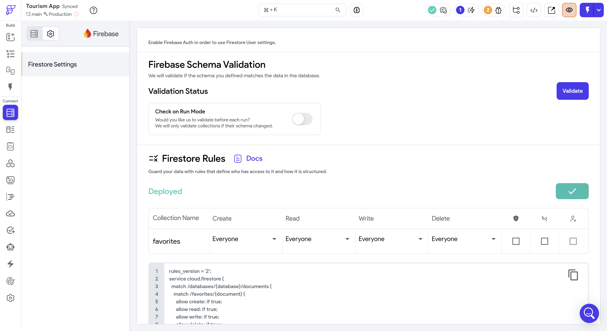

   Kalau mau, bisa juga ditunjukkan versi mentahnya di **Firebase Console → Firestore → Rules**:
   ```javascript
   allow read, write: if true;
   ```
4. Tanyakan ke audiens: *"Apa masalah dari rule ini?"* — beri jeda sebentar untuk diskusi.
5. Tulis contoh Security Rules yang lebih ketat, **untuk dibahas — JANGAN di-deploy**. Biarkan rule `allow read, write: if true;` dari langkah 3 tetap aktif, supaya integrasi Firestore di langkah 7-8 di bawah tetap bisa berjalan (app ini belum punya sistem login, jadi rule yang mensyaratkan `request.auth != null` akan menolak semua read/write kalau benar-benar dipublish sekarang):
   ```javascript
   rules_version = '2';
   service cloud.firestore {
     match /databases/{database}/documents {
       match /favorites/{document} {
         allow read: if request.auth != null;
         allow create: if request.auth != null;
         allow write: if request.auth != null;
         allow delete: if request.auth != null;
       }
     }
   }
   ```
   - `match /favorites/{document}`: rule berlaku untuk setiap dokumen di koleksi ini.
   - Empat verb dipisah eksplisit — `read` (baca), `create` (bikin dokumen baru, dipakai saat user tap Favorite), `write` (ubah dokumen), `delete` (hapus dokumen, dipakai saat user tap Unfavorite) — semuanya mensyaratkan user sedang login (`request.auth != null`). Siapapun yang belum login langsung ditolak di semua operasi.
   - **Momen "aha":** rule awal `allow read, write: if true;` mengizinkan SIAPA SAJA baca/tulis/hapus SEMUA dokumen, tanpa perlu login sama sekali. Rule di atas menutup celah paling dasar itu — tapi karena app ini belum punya login, rule ini tetap sebatas dibahas, tidak dipublish.
6. Jelaskan ke audiens secara verbal: rule produksi minimal harus mensyaratkan user login (`request.auth != null`) di keempat operasi — read, create, write, delete — sebelum boleh menyentuh data apapun. Karena app ini belum punya login, rule tetap dibiarkan longgar (`allow read, write: if true;`) demi kelancaran demo integrasi Firestore berikutnya — sampaikan trade-off ini terus terang ke audiens, jangan disembunyikan.

**Integrasi Firestore — tombol Favorite di `DetailPage` (manual di FlutterFlow editor):**

Karena belum ada auth, `userId` di setiap dokumen di-hardcode jadi string literal `'demo-user'` untuk sesi ini — bukan dari user yang login.

7. Wiring tombol Favorite:
   1. Tambah dua page state baru di `DetailPage`: `isFavorited` (Boolean, default `false`) dan `favoriteDocRef` (tipe **Document Reference**, mengarah ke koleksi `favorites`, kosong/null di awal).
   2. Buka lagi Action Flow **On Page Load** (yang sudah ada fetch `/detail/{id}` di dalamnya). Di ujung/akhir rangkaian action yang sudah ada (setelah percabangan TRUE/FALSE hasil `GetPlaceDetail` selesai, baik sukses maupun gagal tetap lanjut ke sini), tambahkan urutan baru:
      1. Action **Backend Query** (Firestore) → **Query a collection** → koleksi `favorites` → filter `where placeId == <page param placeId>` dan `where userId == 'demo-user'` (literal) → simpan hasilnya ke sebuah variabel (misal `firestoreQuery`).
      2. Tambah **Conditional Action** — kondisinya cek apakah variabel hasil query itu **Document Exists** (ada isinya/tidak null).
      3. **Kalau TRUE (dokumen ada):**
         - **Update Page State** → set `favoriteDocRef` = ambil **Reference** dari hasil query tadi (lihat cara ambilnya di bagian sebelumnya).
         - **Update Page State** → set `isFavorited` = `true`.
      4. **Kalau FALSE (tidak ada dokumen):**
         - **Update Page State** → set `isFavorited` = `false`.
   3. Tambah widget **ToggleIcon** (nama bisa beda tipis tergantung versi FlutterFlow — "ToggleButton"/"ToggleIcon"/"Icon Toggle Button" semuanya widget yang sama, punya properti bawaan: Toggle Value, On Icon Properties, Off Icon Properties) di dekat info tempat wisata:
      - **Toggle Value** → bind ke state `isFavorited`.
      - **On Icon Properties** → icon `Favorite Sharp` (hati solid), warna sesuai tema.
      - **Off Icon Properties** → icon `Favorite Border` (hati outline), warna sesuai tema.
   4. **Cek dulu sebelum wiring action:** widget Toggle ini biasanya auto-flip nilai `isFavorited` sendiri begitu di-tap (karena Toggle Value dua-arah) — SEBELUM action chain kita sempat jalan. Ini penting supaya arah kondisinya gak kebalik. Cara ceknya cepat: tap widgetnya sekali di Test Mode tanpa action apapun dulu, lihat apakah ikonnya langsung berubah (solid ↔ outline). Kalau ya, berarti auto-flip aktif, dan action chain kita harus baca `isFavorited` versi **baru** (setelah tap), bukan versi sebelum tap.
      - Buka Action Flow Editor widget ini (ikon petir di properti, atau klik kanan widget → Add Action), cari trigger **On Toggle** (kalau tidak ada, pakai **On Tap**).
      - Buat **Conditional Action** berdasarkan `isFavorited` versi terkini (setelah auto-flip):
        - **Kalau sekarang `true`** (baru saja di-tap jadi favorite): action **Create Document** → koleksi `favorites` → field `userId: 'demo-user'` (literal), `placeId: <page param placeId>`, `createdAt: <Current Time>` → lalu **Set State**, simpan reference dokumen yang baru dibuat ke `favoriteDocRef`.
        - **Kalau sekarang `false`** (baru saja di-tap jadi unfavorite): action **Delete Document**, target-nya `favoriteDocRef` → lalu **Set State**, clear `favoriteDocRef`.
      - Kalau ternyata widget-nya **tidak** auto-flip (icon gak berubah sebelum action jalan), balik arah kondisinya seperti draft awal: cek `isFavorited` versi **lama** (sebelum tap) untuk memutuskan create/delete, lalu SetState manual ke kebalikannya di akhir masing-masing branch.
   5. Jalankan Test Mode: buka salah satu Detail Page, tap ikon hati — tunjukkan dokumen baru langsung muncul di **Firebase Console → Firestore → koleksi `favorites`**. Tap lagi — tunjukkan dokumennya hilang dari Firestore. Ini bukti live bahwa toggle-nya benar-benar nulis/hapus data, bukan cuma ganti tampilan ikon.

8. Menampilkan data di `FavoritesPage`:
   1. Buka `FavoritesPage`, hapus widget empty-state placeholder-nya.
   2. Tambah widget **ListView** beserta card/item template-nya (widget yang bakal diulang per item).
   3. Baru kemudian set Data Source ListView itu ke **Backend Query** (bukan "Firestore Query" — nama fiturnya persis **Backend Query** di FlutterFlow) → **Query Collection**: `favorites` → tambah **Filter**: `userId == 'demo-user'`.
   4. Untuk tiap item hasil query, tampilkan minimal `placeId`-nya (opsional kalau waktu cukup: tombol unfavorite langsung dari sini, pakai action yang sama seperti langkah 7.4 kondisi "sudah favorite").
   5. Jalankan Test Mode: dari Home, favorite 2-3 tempat wisata lewat Detail Page masing-masing, lalu buka tab Favorites — tunjukkan semuanya muncul di list, semua tercatat atas nama `'demo-user'`.

### 4. Segmen 4 — FlutterFlow MCP: Intro Persiapan Project (6-8 menit, tanpa live demo)

**Framing ke audiens:** *"Semua yang kita bahas sejauh ini — 4 halaman, API call, komponen — sudah ada sejak awal sesi. Sekarang saya jelaskan terus terang bagaimana kerangka ini disiapkan: dibantu Claude (AI assistant) + FlutterFlow MCP, sebelum hari-H."* Segmen ini murni penjelasan lewat slide — tidak ada live demo di FlutterFlow editor.

1. **Apa itu FlutterFlow MCP dan kenapa dipakai:** MCP (Model Context Protocol) adalah jembatan yang menghubungkan CLI/AI assistant lokal (Claude Code, dsb) ke project FlutterFlow — dipakai untuk export code, inspect struktur project, dan push perubahan terprogram. Tegaskan: ini dipakai presenter **sebelum hari-H**, bukan bagian dari live demo panggung.
2. Tunjukkan proses flow persiapan yang benar-benar dipakai, sesuai urutan asli:
   - **Mulai trial FlutterFlow Basic Plan** (14 hari gratis) — dibutuhkan untuk fitur Firebase Integration tanpa batasan plan Free selama masa persiapan.

     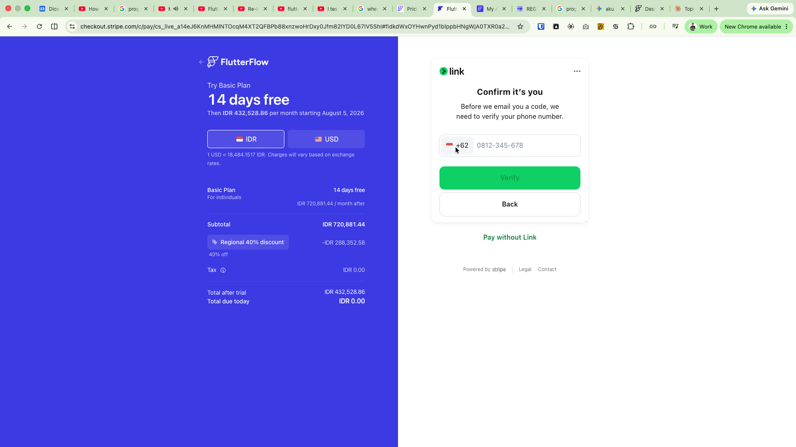
   - Setup environment lokal (Flutter SDK, API token FlutterFlow) — token dibuat sekali dari Account Settings, dipakai CLI untuk otentikasi ke project.

     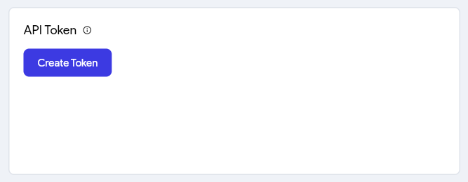
     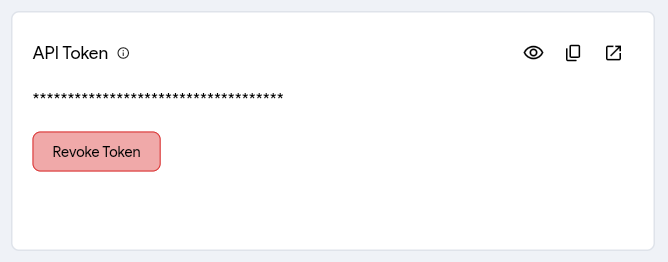
   - `flutterflow ai init` — inisialisasi workspace lokal, sekaligus otomatis mendaftarkan FlutterFlow AI MCP server ke coding agent yang terdeteksi (Claude Code, Gemini CLI, Codex CLI, dst).

     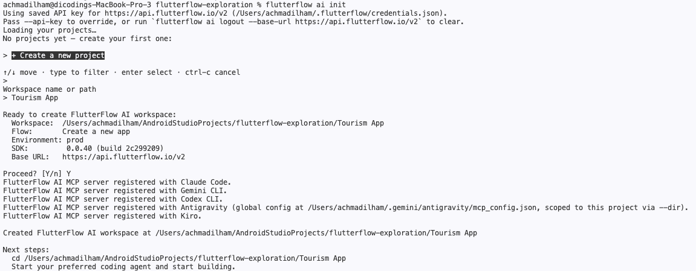
   - **Hubungkan Firebase project** (App Settings → Firebase) — supaya Firestore siap dipakai sebelum Segmen 3. Bisa connect ke project Firebase yang sudah ada lewat akun Google, atau biarkan FlutterFlow yang membuatkan project baru.

     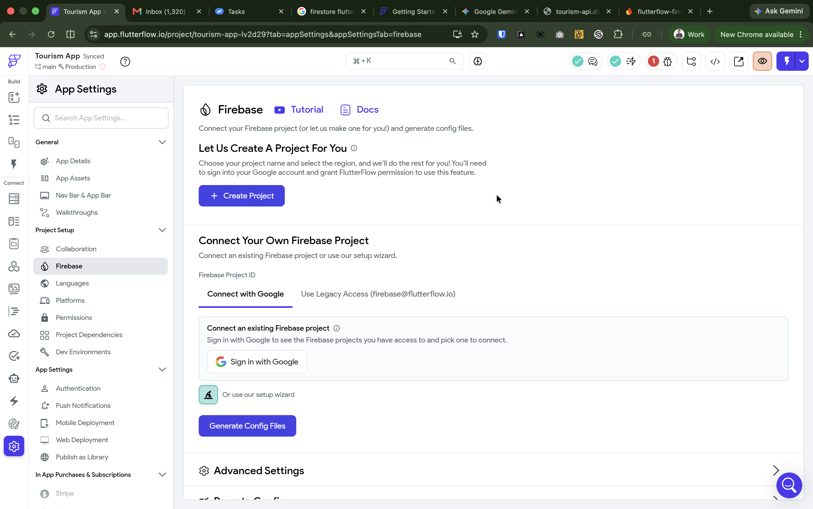
     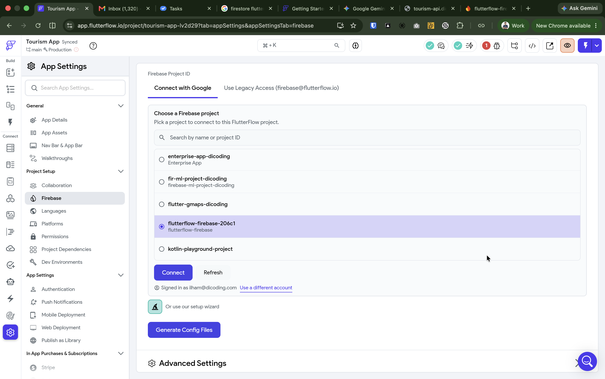
     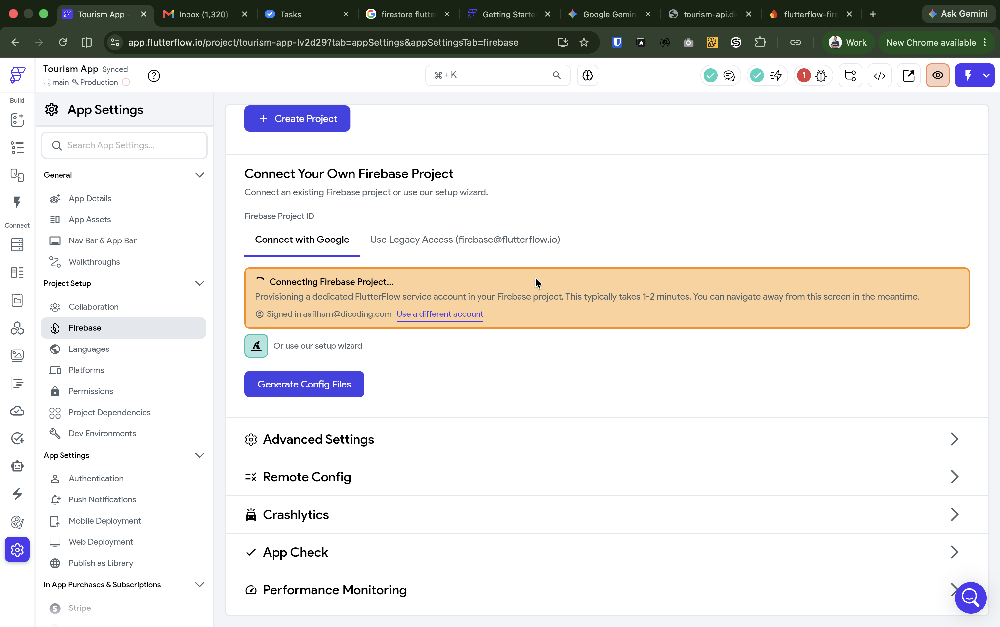
     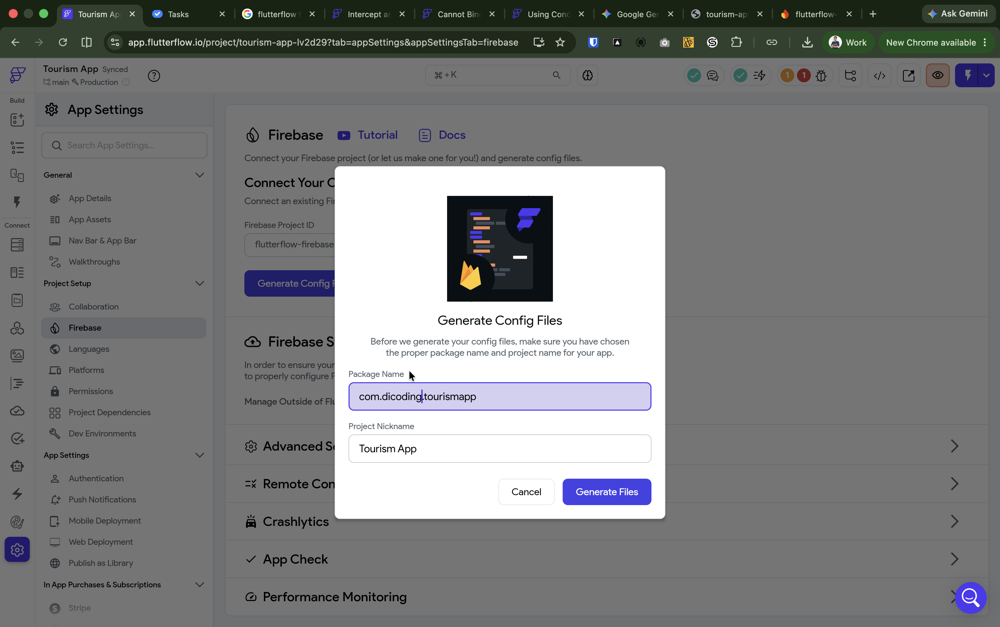
   - AI assistant lokal (Claude) membantu menyelesaikan kendala build (mismatch versi dependency, error environment, dsb).
   - `flutterflow ai inspect` — verifikasi struktur project (jumlah halaman, komponen, API group) sebelum lanjut ke langkah berikutnya.
   - Hasil akhir proses ini: kerangka 4 halaman (`HomePage`, `DetailPage`, `SearchPage`, `FavoritesPage`) + API call `TourismApi` yang dipakai sepanjang sesi — persis yang ditunjukkan di Pembukaan.
3. Jelaskan batas tegas antara dua sisi (bukan before/after, tapi pembagian scope):
   - **MCP + AI (backstage):** scaffolding halaman, export code, inspect struktur. Semua terjadi sebelum hari-H, tidak pernah menyentuh panggung.
   - **Manual di panggung (live):** semua yang baru saja didemokan — debugging key-mismatch (Segmen 1), custom Dart function (Segmen 2), Firestore security rules + integrasi (Segmen 3). Sepenuhnya manual, tanpa AI/CLI aktif selama demo berlangsung.
4. **Pesan kunci:** *"AI siapkan kerangka, developer isi dan kuasai isinya."* AI mempercepat setup awal (halaman kosong, API terdaftar), tapi kemampuan debug, menulis kode manual, dan merancang keamanan data tetap sepenuhnya keahlian developer — dengan atau tanpa AI.

### 5. Penutup (2-3 menit)
- Rekap: kita sudah membuktikan debugging, custom code Dart, dan integrasi database di FlutterFlow bisa dikerjakan manual dengan kontrol penuh — dan sudah transparan soal bagian mana yang dibantu FlutterFlow MCP + AI di belakang layar.
- Bagikan API publik Dicoding lain untuk latihan mandiri: `restaurant-api.dicoding.dev`, `story-api.dicoding.dev`, `notes-api.dicoding.dev`, `forum-api.dicoding.dev`.
- **Bonus — tidak punya akses CLI/MCP?** Semua yang dipraktikkan di sesi ini (custom function, Firestore rules) tetap bisa dicoba langsung dari browser, tanpa install apapun. Buka [flutterflow.io](https://flutterflow.io), klik **+ Create a New Project**, lalu mulai dari kosong atau pilih salah satu **Free Starter App** (ada yang sudah include Firebase Backend) sebagai kerangka awal buat latihan mandiri:

  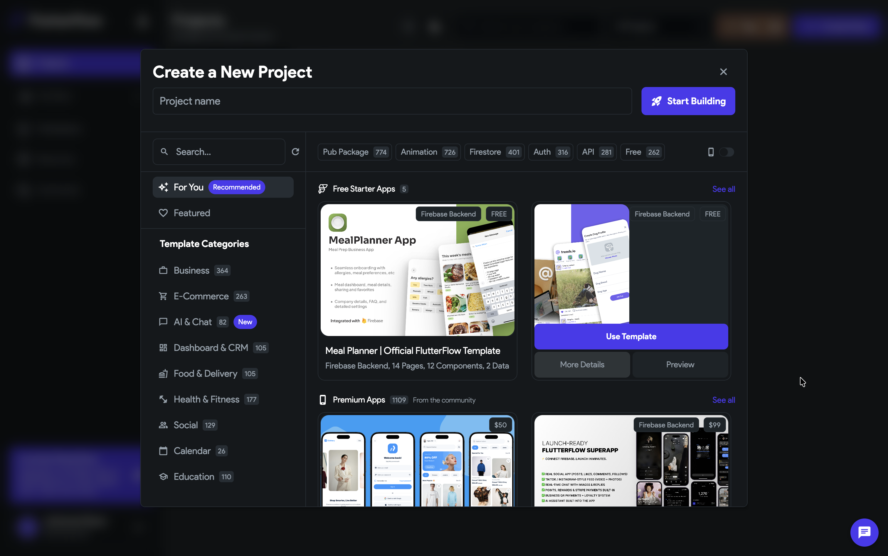
- Sesi tanya jawab.

## Bedah Kode

### `truncateDescription`, `formatLikeCount`, `formatDistance`

Kode lengkap + penjelasan baris-per-baris untuk ketiga Custom Function ini sudah dibahas inline di **Segmen 2** (termasuk cara mendefinisikan Return Value dan Argument-nya lewat panel Function Settings). Lihat bagian "Langkah (Step-by-Step)" di atas untuk detailnya — tidak diulang di sini supaya tidak dobel.

Ringkasan cepat kalau butuh referensi tanpa scroll balik:
- `truncateDescription(description, maxLength)` → potong teks tanpa memenggal kata, tambahkan "...".
- `formatLikeCount(likeCount)` → format angka ribuan jadi "x.xK suka".
- `formatDistance(lat1, lon1, lat2, lon2)` → jarak dua koordinat pakai formula Haversine, hasil dalam km.

### Firestore Security Rules

```javascript
rules_version = '2';
service cloud.firestore {
  match /databases/{database}/documents {
    match /favorites/{document} {
      allow read: if request.auth != null;
      allow create: if request.auth != null;
      allow write: if request.auth != null;
      allow delete: if request.auth != null;
    }
  }
}
```

- `match /favorites/{document}`: rule berlaku untuk setiap dokumen di koleksi ini.
- Empat verb dipisah eksplisit — `read` (baca), `create` (bikin dokumen baru, saat tap Favorite), `write` (ubah dokumen), `delete` (hapus dokumen, saat tap Unfavorite) — semuanya mensyaratkan `request.auth != null` (user sedang login).
- **Momen "aha":** rule awal `allow read, write: if true;` mengizinkan SIAPA SAJA baca/tulis/hapus SEMUA dokumen, tanpa perlu login. Rule final di atas menutup celah itu dengan mensyaratkan login di semua operasi.

## Troubleshooting

| Masalah | Kemungkinan Penyebab | Solusi |
|---|---|---|
| Tap kartu di Home/Search tidak berpindah ke Detail Page sama sekali | Action `onTapAction` pada `PlaceCard` masih kosong (belum disambungkan) — ini kondisi bawaan kerangka placeholder, bukan sesuatu yang rusak saat live | Lakukan Langkah 0 di Segmen 1: set action `onTapAction` ke Navigate To `DetailPage` dengan parameter `placeId`, di kedua halaman (Home & Search) |
| Detail Page tetap kosong setelah fix Segmen 1 | Salah ketik key (`Place` besar vs `place` kecil), atau field lain juga masih salah | Cek ulang response JSON asli dari `/detail/{id}`, pastikan key persis `place` (huruf kecil semua) |
| Test Mode gagal load data sama sekali (semua halaman) | WiFi venue memblokir/CORS ke `tourism-api.dicoding.dev` | Tes akses jaringan venue sebelum hari-H; siapkan hotspot cadangan dari HP |
| Custom Function gagal compile | Typo sintaks Dart saat live coding | Siapkan cheat-sheet kode manual (persis seperti di Bedah Kode) untuk copy-paste langsung kalau situasi mendesak |
| Firestore Rules gagal publish / error saat deploy | Salah bracket/kurung kurawal, atau `rules_version` tertulis salah | Salin persis dari Bedah Kode; test dengan Firebase Rules Playground sebelum live kalau sempat |
| Fitur like/favorite tidak tersimpan meski rules sudah benar | Firebase Authentication belum aktif, jadi `request.auth` selalu null | Pastikan ada mekanisme login (meski sederhana) aktif sebelum demo Segmen 3 |
| Trial FlutterFlow Basic habis/terblokir sebelum hari-H | Batas waktu trial, atau laporan komunitas soal akses terblokir meski token valid | Fallback ke plan Free: copy-paste manual kode Dart ke panel Custom Function/Action/Widget (ingat: plan Free tidak bisa import package pihak ketiga — semua kode di atas sudah pure Dart, jadi tetap kompatibel) |
| `flutter run` gagal compile saat mencoba jalankan hasil export lokal (`generated_code/`) | Versi Flutter SDK lokal lebih baru dari yang divalidasi FlutterFlow — contoh nyata: `font_awesome_flutter` versi lama (`10.7.0`, default template FlutterFlow) tidak kompatibel dengan `IconData` yang jadi `final class` di Flutter versi baru | Ini **tidak memengaruhi demo live** karena Test Mode berjalan di infrastruktur FlutterFlow sendiri, bukan `flutter run` lokal. Kalau butuh jalankan lokal untuk keperluan lain, downgrade Flutter SDK lokal atau upgrade `font_awesome_flutter` ke `11.x` (catatan: versi 11.x butuh penyesuaian tambahan karena ada breaking change API `FaIcon`) |
| Bottom nav / halaman hilang tiba-tiba setelah push dari CLI (hanya relevan saat persiapan, bukan saat live) | FlutterFlow AI otomatis menghapus halaman placeholder bawaan project yang masih kosong — kalau nama halaman baru sempat "bentrok" dengan placeholder itu, perubahan bisa ter-skip diam-diam | Setelah push, selalu verifikasi jumlah & nama halaman lewat `flutterflow ai inspect <project-id>` sebelum lanjut ke langkah berikutnya |
